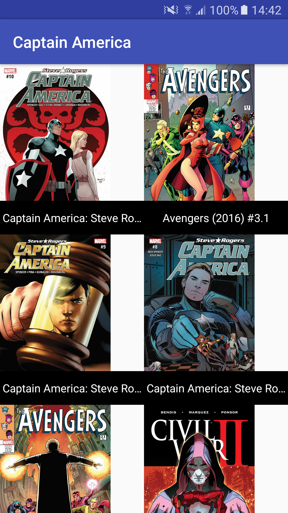
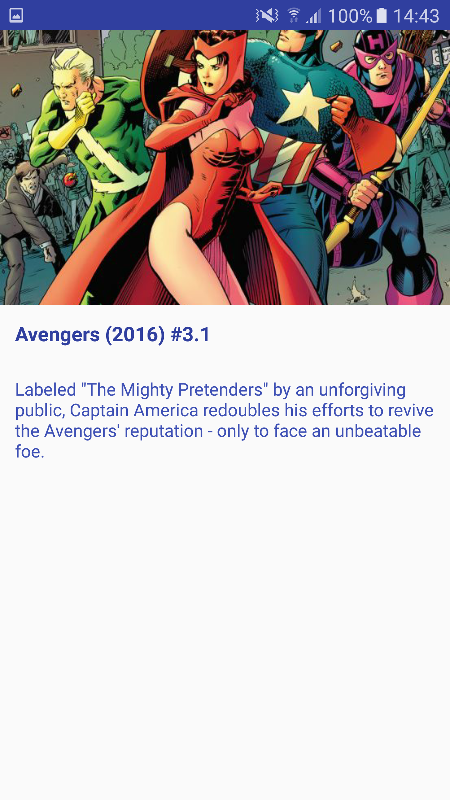
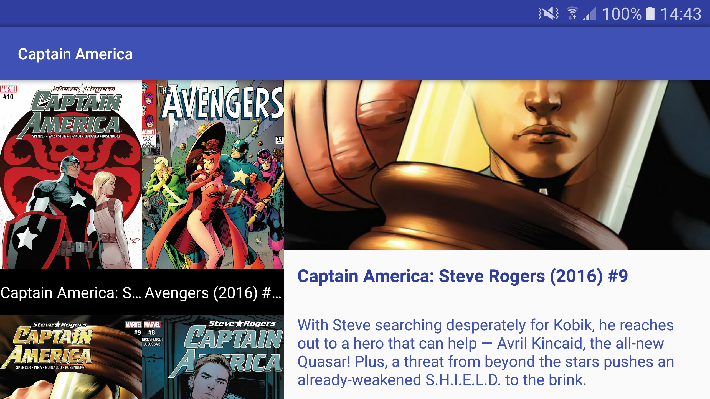

# Android-Marvel
This is a sample app that use Marvel API 





# Description
This app is build based on Uncle Bob's clean architecture approach and MVP pattern always develop with Clean Code. 
The app uses Rx 2.0, Dagger 2 and Retrofit2.

# Usage
**Put the keys (public and private) on DataSourceModule:**
```java
  @Provides @Named("public_api_key") public String providePublicKey() {
    return "yourPublicKey";
  }

  @Provides @Named("private_api_key") public String providePrivateKey() {
    return "yourPrivateKey";
  }
```
# Libraries

* [RecyclerView](https://developer.android.com/training/material/lists-cards.html?hl=en)
* [RxJava](https://github.com/ReactiveX/RxJava)
* [RxAndroid](https://github.com/ReactiveX/RxAndroid)
* [RxKotlin](https://github.com/ReactiveX/RxKotlin)
* [Retrofit](https://github.com/square/retrofit)
* [Dagger](https://github.com/google/dagger)
* [Picasso](https://github.com/square/picasso)
* [Butterknife](https://github.com/JakeWharton/butterknife)
* [Frodo](https://github.com/android10/frodo)

# Help me
Pull requests are more than welcome, help me and others improve this app.

# Developed By

* Jota Ramirez - <jotaramirez90@gmail.com>

<a href="https://twitter.com/JotaRamirez90">
  
</a>
<a href="https://es.linkedin.com/in/josejuanramirez">
  
</a>


# License
	Copyright 2017 Jota Ramirez

	Licensed under the Apache License, Version 2.0 (the "License");
	you may not use this file except in compliance with the License.
	You may obtain a copy of the License at

		http://www.apache.org/licenses/LICENSE-2.0

	Unless required by applicable law or agreed to in writing, software
	distributed under the License is distributed on an "AS IS" BASIS,
	WITHOUT WARRANTIES OR CONDITIONS OF ANY KIND, either express or implied.
	See the License for the specific language governing permissions and
	limitations under the License.
